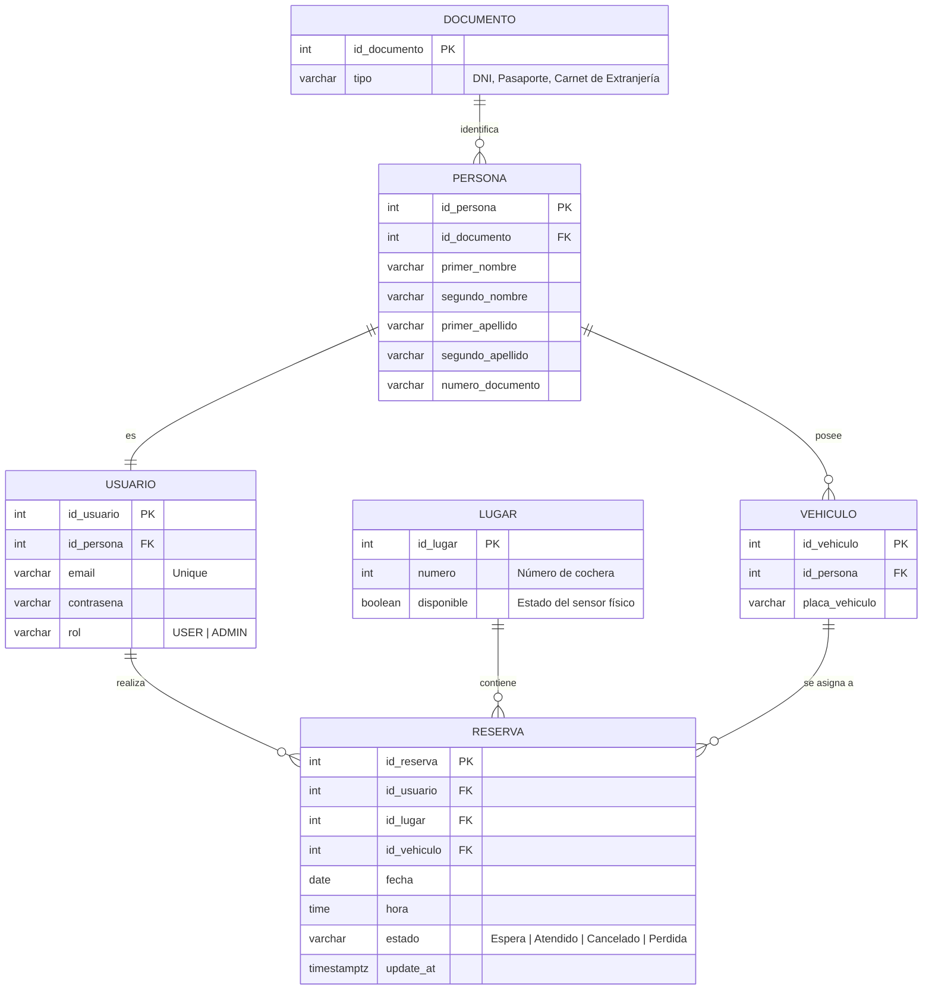

# 🚗 Estacionamiento Inteligente (Smart Parking)

[](https://react.dev/)
[](https://vite.dev/)
[](https://tailwindcss.com/)
[](https://threejs.org/)
[](https://nodejs.org/)
[](https://www.postgresql.org/)

**Estacionamiento Inteligente** es una plataforma web full-stack de última generación diseñada para la gestión, reserva y visualización interactiva de plazas de estacionamiento en tiempo real. 

Orientada a brindar una experiencia de usuario (UX) sumamente fluida y visualmente impactante, la aplicación destaca por integrar un **croquis tridimensional interactivo (3D)** de la playa de estacionamiento y un panel administrativo con **gráficas de ocupación dinámicas**.

---

## 🎨 Filosofía de Diseño y UX/UI

La interfaz de usuario ha sido concebida bajo principios de **Diseño Futurista e Inmersivo**:
- **Estética Dark Mode & Neon**: Paleta basada en tonos pizarra oscuros (`slate-900` / `gray-900`) con acentos en colores neón de alta luminancia (Cyan para realces de interfaz y reservas propias, Verde Neón para disponibilidad y Rojo Vibrante para ocupado/alerta).
- **Glassmorphism**: Paneles de información semitransparentes con efectos de desenfoque de fondo (`backdrop-blur`) y bordes sutiles que generan sensación de profundidad.
- **Micro-interacciones tridimensionales**: El mapa de estacionamiento 3D permite rotación orbital, paneo y zoom fluidos mediante gestos táctiles o de mouse (`OrbitControls`), reaccionando instantáneamente al hacer clic sobre una plaza libre para iniciar el proceso de reserva.

---

## 🚀 Características Principales

### Para los Usuarios (Clientes)
1. **Visualización 3D Interactiva**: Renderizado tridimensional en tiempo real del estacionamiento, diferenciando estados por colores:
   - 🟢 **Verde**: Disponible físicamente y sin reservas activas.
   - 🔴 **Rojo**: Ocupado físicamente (sensor activo) o reservado por otro usuario.
   - 🔵 **Azul**: Reservado por el usuario logueado en la sesión.
2. **Reservas Flexibles**: Permite seleccionar una plaza desde el mapa 3D y agendarla especificando fecha y hora.
3. **Gestión de Vehículos**: Vinculación de la placa vehicular obligatoria al registrarse.
4. **Sincronización en Tiempo Real**: Consulta periódica automática (polling cada 10 segundos) para mantener la disponibilidad actualizada sin refrescar la página.

### Para Administradores
1. **Control de Espacios Físicos (Simulación de Sensores)**: Un panel interactivo que permite alternar el estado físico del lugar (`OCUPADO` / `LIBRE`), simulando la detección de un vehículo por sensor ultrasónico o cámara.
2. **Dashboard Estadístico**: Gráfico de barras interactivo desarrollado con Recharts que muestra el estado de ocupación general, plazas libres y cantidad de reservas activas.
3. **Gestión de Reservas Global**: Tabla de control para visualizar y cancelar reservas de cualquier usuario.

---

## 🛠️ Stack Tecnológico

El proyecto está dividido en dos partes principales:

### Frontend
- **Framework & Builder**: React 19 + Vite (para compilación instantánea y HMR).
- **Estilos**: Tailwind CSS v4 (con soporte directo de imports modernos y optimización CSS nativa en Vite).
- **Modelado 3D**: Three.js, `@react-three/fiber` (declarativo para React) y `@react-three/drei` (helpers interactivos y de tipografía 3D).
- **Gestión de Estado**: Zustand (gestión ligera y reactiva del estado de autenticación y token).
- **Visualización de Datos**: Recharts (gráficos responsivos).
- **Soporte Offline/PWA**: Configurado mediante `vite-plugin-pwa`.
- **Cliente HTTP**: Axios (con interceptores para adjuntar dinámicamente el Token JWT).

### Backend
- **Entorno de Ejecución**: Node.js con Express v5 (Web framework rápido y minimalista).
- **Base de Datos**: PostgreSQL (Base de datos relacional robusta).
- **Seguridad**: JWT (Tokens de acceso para autenticación) y Bcrypt (encriptación y hash de contraseñas).
- **Validación**: Express Validator (validación robusta de formatos de entrada, tipos de documentos, etc.).
- **Controladores de Base de Datos**: Módulo `pg` (Pool de conexiones).

---

## 📊 Arquitectura de Base de Datos (PostgreSQL)

El sistema emplea un esquema relacional normalizado estructurado en torno a las siguientes entidades:



### Reglas de Negocio Implementadas en Base de Datos:
- **Restricción de Unicidad (`uq_reserva_lugar_tiempo`)**: Evita que se solapen reservas duplicadas para el mismo lugar en la misma fecha y hora (`id_lugar`, `fecha`, `hora`), ignorando aquellas con estado `'Cancelado'` o `'Perdida'`.
- **Flujo de Estados de Reserva**: Por defecto, se crean en `'Espera'`. Cuenta con expiración automática (Lazy Expiration): cuando ha transcurrido la hora pactada de una reserva en espera, su estado cambia automáticamente a `'Perdida'`, liberando el cajón del estacionamiento. Los usuarios pueden cancelarlas (cambiando a `'Cancelado'`), y los administradores pueden cambiar el estado a cualquiera de los cuatro posibles (incluyendo `'Atendido'` al concretarse el ingreso físico).
- **Validación Estricta de Documentos**:
  - **DNI**: Exactamente 8 caracteres numéricos.
  - **Pasaporte**: 9 caracteres (3 letras seguidas de 6 números).
  - **Carnet de Extranjería**: Exactamente 9 caracteres numéricos.
- **Vehículo Obligatorio**: Cada reserva requiere asociar una placa de vehículo activa vinculada a la persona que reserva.

---

## 📂 Estructura del Repositorio

```text
EstacionamientoInteligente/
│
├── backend/                       # API Rest en Node.js + Express
│   ├── config/                    # Configuración de servicios externos
│   │   └── db.js                  # Inicialización y Pool de conexiones de PostgreSQL
│   ├── controllers/               # Lógica de negocio por entidad
│   │   ├── authController.js      # Registro, Login, perfil e información de vehículos
│   │   ├── reservationsController.js # CRUD y validaciones de reservas
│   │   └── spacesController.js    # Obtención de lugares con estado dinámico
│   ├── middlewares/               # Validaciones intermedias
│   │   └── authMiddleware.js      # Validación de tokens JWT y permisos ADMIN
│   ├── routes/                    # Enrutadores de Express
│   │   ├── authRoutes.js
│   │   ├── reservationsRoutes.js
│   │   └── spacesRoutes.js
│   ├── .env.example               # Plantilla para variables de entorno del backend
│   ├── index.js                   # Archivo de inicio del servidor API
│   ├── inspect_lugar.js           # Script de prueba de base de datos
│   └── package.json               # Dependencias y scripts del backend
│
└── frontend/                      # Cliente web SPA en React
    ├── public/                    # Archivos públicos y assets estáticos
    ├── src/                       # Código fuente de React
    │   ├── assets/                # Imágenes y recursos estéticos
    │   ├── components/            # Componentes reutilizables
    │   │   ├── 3d/
    │   │   │   └── ParkingLot.jsx # Canvas 3D de plazas usando React Three Fiber
    │   │   └── Navbar.jsx         # Barra de navegación adaptable al rol
    │   ├── pages/                 # Componentes de página completos
    │   │   ├── AdminDashboard.jsx # Vista de administrador (Sensor / Estadísticas)
    │   │   ├── Dashboard.jsx      # Panel principal de reserva y mapa 3D
    │   │   ├── Login.jsx          # Acceso de usuarios
    │   │   └── Register.jsx       # Registro detallado (Persona, Vehículo, Usuario)
    │   ├── services/              # Clientes de API remota
    │   │   └── api.js             # Instancia de Axios con interceptor JWT
    │   ├── store/                 # Gestión de estados compartidos
    │   │   └── authStore.js       # Store de Zustand para token y sesión de usuario
    │   ├── App.jsx                # Enrutador y Layout principal
    │   ├── index.css              # Estilos globales y variables de diseño CSS v4
    │   └── main.jsx               # Punto de entrada de React
    ├── vite.config.js             # Configuración de empaquetado Vite y PWA
    └── package.json               # Dependencias y scripts del frontend
```

---

## 🛠️ Instrucciones de Instalación y Despliegue

### Requisitos Previos
- **Node.js** v18 o superior.
- **PostgreSQL** v14 o superior.

---

### Paso 1: Configurar la Base de Datos (PostgreSQL)

1. Crea una base de datos en PostgreSQL llamada `estacionamiento_inteligente` (o el nombre que prefieras).
2. Asegúrate de crear las tablas siguiendo el modelo relacional descrito en la sección de **Arquitectura de Base de Datos**.
3. (Opcional) Asegúrate de poblar la tabla `Documento` con los tipos iniciales:
   ```sql
   INSERT INTO Documento (tipo) VALUES ('DNI'), ('Pasaporte'), ('Carnet de Extranjería');
   ```
4. Registra los lugares de estacionamiento en la tabla `Lugar` (por ejemplo, del 1 al 10) para el correcto renderizado del croquis 3D:
   ```sql
   INSERT INTO Lugar (numero, disponible) VALUES 
   (1, true), (2, true), (3, true), (4, true), (5, true),
   (6, true), (7, true), (8, true), (9, true), (10, true);
   ```

---

### Paso 2: Despliegue del Backend

1. Dirígete a la carpeta `backend`:
   ```bash
   cd backend
   ```
2. Instala las dependencias necesarias:
   ```bash
   npm install
   ```
3. Crea un archivo `.env` en la raíz de la carpeta `backend` basado en el siguiente ejemplo:
   ```env
   PORT=5000
   JWT_SECRET=tu_secreto_super_seguro_para_jwt
   DB_USER=tu_usuario_postgres
   DB_HOST=localhost
   DB_NAME=estacionamiento_inteligente
   DB_PASSWORD=tu_contrasena_postgres
   DB_PORT=5432
   NODE_ENV=development
   ```
4. Inicia el servidor backend:
   ```bash
   npm start
   ```
   *El backend estará corriendo en el puerto configurado (por defecto: [http://localhost:5000](http://localhost:5000)).*

---

### Paso 3: Despliegue del Frontend

1. Abre una nueva consola y dirígete a la carpeta `frontend`:
   ```bash
   cd frontend
   ```
2. Instala las dependencias:
   ```bash
   npm install
   ```
3. Inicia el servidor de desarrollo de Vite:
   ```bash
   npm run dev
   ```
   *El frontend estará disponible en el puerto indicado por Vite (por defecto: [http://localhost:5173](http://localhost:5173)).*

---

## 👥 Roles y Usuarios de Prueba

Para probar ambas facetas de la aplicación, puedes crear dos perfiles distintos mediante el formulario de registro:

- **Usuario Regular**: Al registrarte, la base de datos te asignará automáticamente el rol `USER`. Podrás reservar lugares, registrar tu vehículo y ver tus reservas en el dashboard principal con el croquis interactivo 3D.
- **Administrador**: Para habilitar un administrador, puedes registrar una cuenta normal y luego actualizar su rol directamente en la base de datos:
  ```sql
  UPDATE Usuario SET rol = 'ADMIN' WHERE email = 'tu-email-admin@ejemplo.com';
  ```
  Al ingresar con esta cuenta, tendrás acceso al botón **"Admin"** en la barra de navegación que te llevará al panel estadístico, simulador de sensores y cancelador de reservas.
